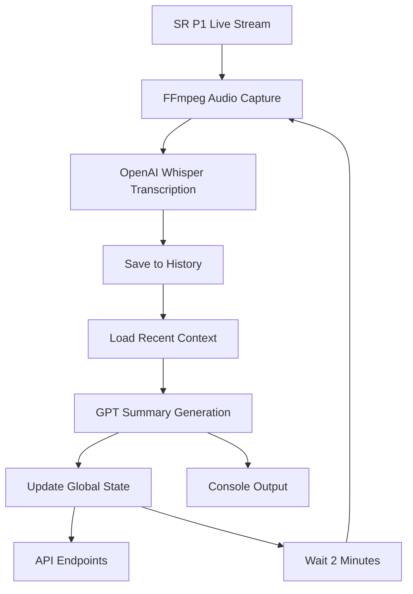

# SR-Now 🎧

**Real-time AI-powered summarization of Sveriges Radio P1 live stream**

SR-Now continuously monitors Sveriges Radio P1's live stream, transcribes the audio using OpenAI's Whisper API, and generates contextual summaries using GPT. Perfect for staying updated on Swedish radio content with minimal effort.

## ✨ Features

- **🎙️ Continuous Audio Monitoring**: Records 30-second chunks every 2 minutes from SR P1 live stream
- **🤖 AI-Powered Transcription**: Uses OpenAI Whisper for accurate Swedish speech recognition
- **📝 Context-Aware Summaries**: GPT generates concise summaries with awareness of recent program context
- **🌐 REST API**: Access latest summaries programmatically via HTTP endpoints
- **💾 Persistent History**: Maintains 24-hour transcription history for context building
- **🔄 Real-time Processing**: Background threading for continuous operation
- **📊 Status Monitoring**: Track processing status and health via API

## 🚀 Quick Start

### Prerequisites

- Python 3.8+
- FFmpeg (for audio processing)
- OpenAI API key

### Installation

1. **Clone and setup**:
   ```bash
   git clone <repository-url>
   cd sr-now
   python -m venv .venv
   source .venv/bin/activate  # On Windows: .venv\Scripts\activate
   pip install -r requirements.txt
   ```

2. **Set your OpenAI API key**:
   ```bash
   export OPENAI_API_KEY="your-api-key-here"
   ```

3. **Run the application**:
   ```bash
   python sr-now.py
   ```

## 📡 API Endpoints

Once running, the following endpoints are available at `http://localhost:5001`:

### `GET /api/latest-summary`
Get the most recent AI-generated summary.

**Response:**
```json
{
  "success": true,
  "summary": "Diskussion om tränaren Jonas Thomassons beslut och spelaransvar i laget.",
  "last_updated": "2025-10-14T10:45:30.123456",
  "timestamp": "2025-10-14T10:50:15.789012"
}
```

### `GET /api/status`
Monitor the processing thread status.

**Response:**
```json
{
  "success": true,
  "status": "Recording audio...",
  "last_updated": "2025-10-14T10:45:30.123456",
  "timestamp": "2025-10-14T10:50:15.789012"
}
```

### `GET /api/health`
Health check endpoint.

**Response:**
```json
{
  "success": true,
  "service": "SR-Now Live Summary",
  "status": "healthy",
  "timestamp": "2025-10-14T10:50:15.789012"
}
```

## 🔧 Configuration

### Environment Variables

- `OPENAI_API_KEY` - Required: Your OpenAI API key for Whisper and GPT access

### Customization

Key parameters in `sr-now.py`:

- `STREAM_URL` - Radio stream URL (default: SR P1)
- Recording interval: 120 seconds (2 minutes)
- Recording duration: 30 seconds per capture
- Context window: 2 hours of previous transcriptions

## 📁 Project Structure

```
sr-now/
├── sr-now.py              # Main application
├── transcriptions_history.json  # Persistent transcription storage
├── diagnostic.py          # Component testing script
├── test_threading.py      # Threading functionality test
├── test_api_endpoint.py   # API testing script
├── README.md              # This file
└── requirements.txt       # Python dependencies
```

## 🛠️ How It Works

1. **Audio Capture**: FFmpeg records 30-second clips from SR P1 live stream
2. **Transcription**: OpenAI Whisper converts Swedish audio to text
3. **Context Building**: Recent transcriptions provide program context
4. **Summary Generation**: GPT creates concise, contextual summaries
5. **API Serving**: Flask serves summaries via REST endpoints
6. **Continuous Loop**: Process repeats every 2 minutes

## 📊 Processing Flow



## 🧪 Testing & Diagnostics

### Test Individual Components
```bash
python diagnostic.py
```

### Test API Endpoints
```bash
python test_api_endpoint.py
```

### Test Threading
```bash
python test_threading.py
```

## 🔍 Troubleshooting

### Common Issues

1. **No audio capture**:
   - Verify FFmpeg is installed: `ffmpeg -version`
   - Check internet connection to stream URL

2. **Transcription failures**:
   - Ensure `OPENAI_API_KEY` is set correctly
   - Verify OpenAI account has API credits

3. **API not responding**:
   - Check if port 5001 is available
   - Monitor processing status via `/api/status`

### Debug Mode

For detailed logging, modify the exception handling in `continuous_processing()` to print full error details.

## 🔒 Security Notes

- Store API keys securely, never commit them to version control
- The Flask server runs in development mode (not for production)
- Consider rate limiting for production API usage

## 🤝 Contributing

1. Fork the repository
2. Create a feature branch
3. Make your changes
4. Test with the diagnostic scripts
5. Submit a pull request

## 📄 License

This project is for educational and personal use. Please respect Sveriges Radio's terms of service and OpenAI's usage policies.

## 🙋‍♂️ Support

For issues or questions:
1. Check the troubleshooting section
2. Run diagnostic tests
3. Review the API status endpoint
4. Open an issue with detailed error information

---

**Made with ❤️ for the Swedish radio community**
